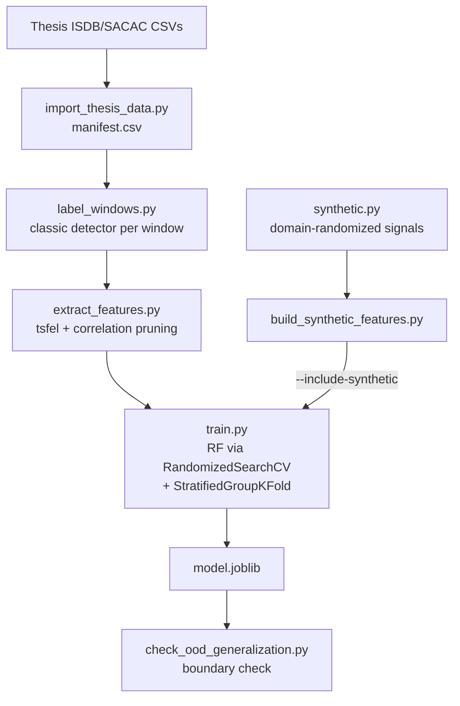

# valve-stiction-ml

[](https://github.com/maulanaiskak/valve-stiction-ml/actions)

Training pipeline for a valve stiction detection classifier — the ML foundation of a distributed, real-time control-valve stiction detection pipeline. Rebuilds the ML side of an undergraduate thesis (a custom Random Forest on hand-rolled time-series features, trained on file-level labels) as a reproducible, tested, evidence-driven training project, and is where a real train/serve model-generalization failure (found once this model was deployed live) was diagnosed and fixed.

The full design rationale — including several real bugs found and fixed along the way, and honest documentation of what didn't work — lives in **[docs/ML_PLAN.md](docs/ML_PLAN.md)**. This README is the practical "how to run it" companion.

**Feeds a 5-repo distributed system** — see [System Design (HLD)](https://github.com/maulanaiskak/valve-stiction-backend/blob/main/docs/HLD.md) and [Whitepaper](https://github.com/maulanaiskak/valve-stiction-backend/blob/main/docs/WHITEPAPER.md) for the full picture.

| Repo | Role |
|---|---|
| **valve-stiction-ml** (this repo) | Trains the RF model; classic detector reused directly (not vendored) by the pipeline |
| [valve-stiction-simulator](https://github.com/maulanaiskak/valve-stiction-simulator) | Synthetic PV/OP signal generator |
| [valve-stiction-ingestion](https://github.com/maulanaiskak/valve-stiction-ingestion) | MQTT subscribe, windowing |
| [valve-stiction-detection](https://github.com/maulanaiskak/valve-stiction-detection) | Runs this repo's classic detector + trained model live |
| [valve-stiction-backend](https://github.com/maulanaiskak/valve-stiction-backend) | REST + WebSocket API |
| [valve-stiction-frontend](https://github.com/maulanaiskak/valve-stiction-frontend) | React dashboard |

## Why this exists

The original thesis assigned stiction labels **per file**, then propagated that label to every 100-sample window cut from it — a file labeled "stiction" doesn't necessarily stick for its entire recording, so many windows were mislabeled. Retraining against those labels would just teach a model to reproduce that mistake.

Instead: a training-free, unsupervised classic detector (ellipse-fit + Kano pattern check, `src/valve_stiction_ml/classic.py`) labels every window on its own signal shape, using process-control theory instead of learned parameters. The RF is trained to cheaply approximate *that*, not the old file-level labels — which are kept around only as a sanity check, never as a training target.

## Training pipeline



## Setup

```bash
python3 -m venv .venv
source .venv/bin/activate
pip install -e ".[dev]"
```

Requires the original thesis repo's `Data/` folder (ISDB + SACAC CSVs) — not included here. Point `scripts/import_thesis_data.py --source <path>` at it, or edit `DEFAULT_SOURCE` in that script.

## Reproducing the full pipeline

Each step writes to `data/processed/` or `models/`/`reports/` (all gitignored — regenerate, don't expect them checked in).

```bash
# 1. Copy thesis CSVs into data/raw/, build data/processed/manifest.csv
python scripts/import_thesis_data.py

# 1b. Optional: pull in SACAC files present on the official portal
#     (sacac.org.za) but missing from the thesis repo's copy -- see the
#     script's docstring for which ones are actually usable and why
python scripts/download_additional_sacac.py

# 2. Run the classic detector (ellipse-fit + Kano) over every window,
#    tune ellipse_threshold on ISDB only -> data/processed/window_labels.csv
python scripts/label_windows.py

# 3. Extract tsfel features for confident (non-"uncertain") windows,
#    prune correlated features -> data/processed/features.csv
python scripts/extract_features.py

# 3b. Optional: build synthetic domain-randomized training data
#     (see "Closing a real generalization gap" below)
python scripts/build_synthetic_features.py

# 4. Train RF (RandomizedSearchCV + StratifiedGroupKFold on ISDB),
#    evaluate on held-out SACAC -> models/<date>_<git-hash>/model.joblib
python -m valve_stiction_ml.train              # baseline
python -m valve_stiction_ml.train --include-synthetic   # + synthetic augmentation (deployed)

# 5. Optional: sanity-check the feature pipeline via unsupervised
#    clustering -> reports/cluster_sanity_check.png
python scripts/cluster_sanity_check.py

# 6. Optional: stress-test generalization outside the trained parameter
#    ranges (see "Closing a real generalization gap" below)
python scripts/check_ood_generalization.py
```

Run tests with `pytest`. A handful (`test_classic_real_fixtures.py`) are skipped until step 1 has been run, since they validate against real SACAC files.

## Using a trained model

```python
from pathlib import Path
from valve_stiction_ml.inference import load_artifact, predict_window

artifact = load_artifact(Path("models/<date>_<hash>/model.joblib"))
result = predict_window(artifact, pv_window, op_window)  # raw, non-normalized arrays
# {"label": "yes" | "no", "probability": 0.52}
```

`pv_window`/`op_window` must be raw (non-normalized) arrays of exactly `artifact["window_size"]` samples — normalization and feature extraction happen inside `predict_window`, matching exactly what training did. The artifact is self-describing (feature list, window size, normalization, decision threshold, git commit, full metrics all travel with the model file), specifically so a caller never has to hardcode or guess any of that separately — which is what caused a real bug in the original thesis code (`subscribe.py`'s feature list could silently drift out of sync with the model it loaded).

## Results

|  | ISDB (StratifiedGroupKFold CV) | SACAC (held-out test) |
|---|---|---|
| Precision | 0.733 | 0.866 |
| Recall | 0.839 | 0.522 |
| F1 | 0.782 | 0.651 |
| ROC-AUC | 0.944 | 0.865 |
| PR-AUC | 0.809 | 0.788 |

Read as: *does a cheap RF approximate the classic detector well* — not *does this detect real-world stiction with X% accuracy*. Precision/recall trade off differently between ISDB and SACAC (SACAC: fewer false positives, more misses) — an honest generalization gap between two independently-sourced benchmark corpora, not hidden or averaged away.

Two things were investigated and *not* applied, on evidence, not assumption:
- **Gradient-boosting comparison**: `HistGradientBoostingClassifier` beats RF on ISDB's internal CV but loses clearly on SACAC (PR-AUC 0.745 vs. 0.788, F1 0.608 vs. 0.651) — RF stays primary, now backed by a real comparison rather than an unexamined default.
- **Decision-threshold tuning** (without synthetic augmentation): the F1-maximizing threshold found on ISDB alone (0.515) scored *worse* on SACAC than the plain 0.5 default (F1 0.628 vs. 0.651) — kept 0.5.

## Closing a real generalization gap (§15 of ML_PLAN.md)

This model was deployed live in [valve-stiction-detection](https://github.com/maulanaiskak/valve-stiction-detection) and, in a real streaming evaluation against [valve-stiction-simulator](https://github.com/maulanaiskak/valve-stiction-simulator)'s synthetic signal, scored **AUC 0.079** — worse than random — despite the 0.865 ROC-AUC above. Not a bug: pure train/serve distribution shift, since the model had only ever seen real industrial recordings.

Fixed with **synthetic domain-randomization augmentation** (`synthetic.py`, `scripts/build_synthetic_features.py`): a randomized version of the simulator's own signal model, trained on alongside real ISDB data, with SACAC kept fully untouched as the real-data test set throughout.

| | SACAC (real, untouched) | Live stream (deployed signal) |
|---|---|---|
| Before augmentation | ROC-AUC 0.865 | **AUC 0.079** |
| After augmentation | ROC-AUC 0.865 (unchanged) | **AUC 0.9998, 99.6% accuracy** |

Checked directly whether this is just overfitting (`scripts/check_ood_generalization.py`): group-based CV rules out train/validation leakage, and SACAC is unaffected — but signals with parameters deliberately sampled *outside* the trained ranges score AUC ~0.43-0.47, chance level. The model generalizes within the family of signals it was shown, not universally — the honest boundary is documented, not hidden. Full methodology, including a real label-quality bug a unit test caught mid-fix, in `docs/ML_PLAN.md` §15.

## Known limitations (see ML_PLAN.md for full detail)

- **~45-49% of windows are "uncertain"** and excluded from training — the classic detector's two components (ellipse-fit, Kano) are conservative by design and don't always agree. Investigated and kept this way deliberately (§13).
- **Clustering sanity check came back negative** (§10.1) — unsupervised structure in the feature space doesn't cleanly separate stiction from non-stiction; the RF's supervised result isn't independently corroborated by it.
- **Small dataset**: 2232 confident windows total (427 positive) after all filtering, from 115 source files.
- **Window size (100 samples) was investigated, not assumed** — tried larger windows expecting better results; they were empirically worse given how the Kano heuristic aggregates strokes (§13).
- **The RF's generalization is bounded to the signal families it's trained on** (§15) — real industrial recordings plus a specific synthetic regime; a materially different signal shape can still expose a similar gap, which is why the classic detector runs unconditionally in the live pipeline rather than being replaced.
- Neither the classic detector nor the RF is claimed as ground truth — even literature methods this compares against top out around 85-90% on the ISDB benchmark.

## Project structure

```
src/valve_stiction_ml/
  dataset.py       loading, windowing, manifest
  classic.py        ellipse-fit + Kano detector (training-free label source)
  features.py         per-window normalization + tsfel extraction
  synthetic.py           domain-randomized signal generator (training augmentation)
  models.py             RF training (RandomizedSearchCV + StratifiedGroupKFold)
  evaluate.py              metrics, sanity-check reporting
  train.py                   CLI entrypoint, writes the model artifact
  inference.py                  load a trained artifact, score one window
scripts/
  import_thesis_data.py, download_additional_sacac.py   data prep
  label_windows.py, extract_features.py                   classic labels -> features
  build_synthetic_features.py                                synthetic training/held-out corpora
  cluster_sanity_check.py                                       unsupervised sanity check
  check_ood_generalization.py                                     out-of-distribution stress test
configs/default.yaml  window size, classic-detector threshold, RF search space
docs/ML_PLAN.md     full design rationale, findings, and decision log
```
